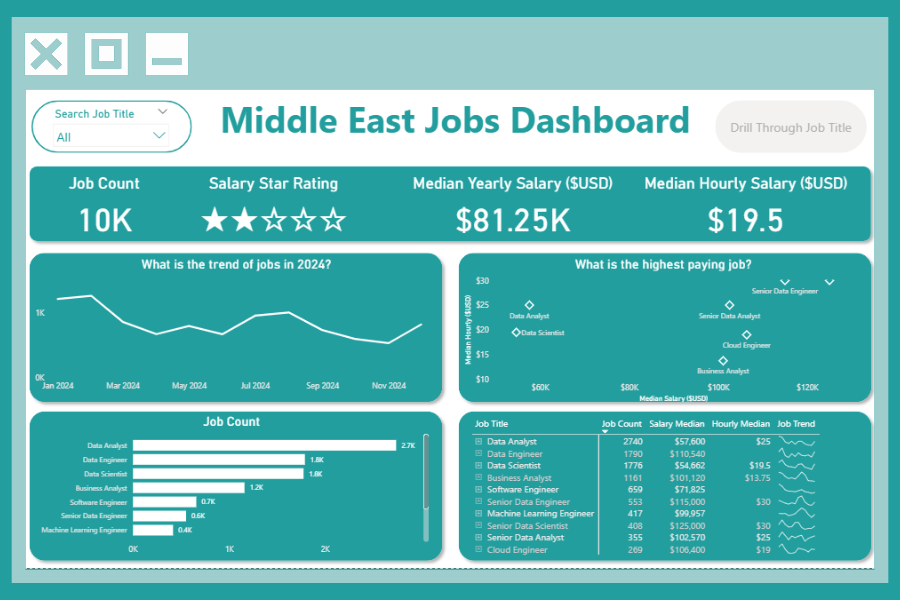
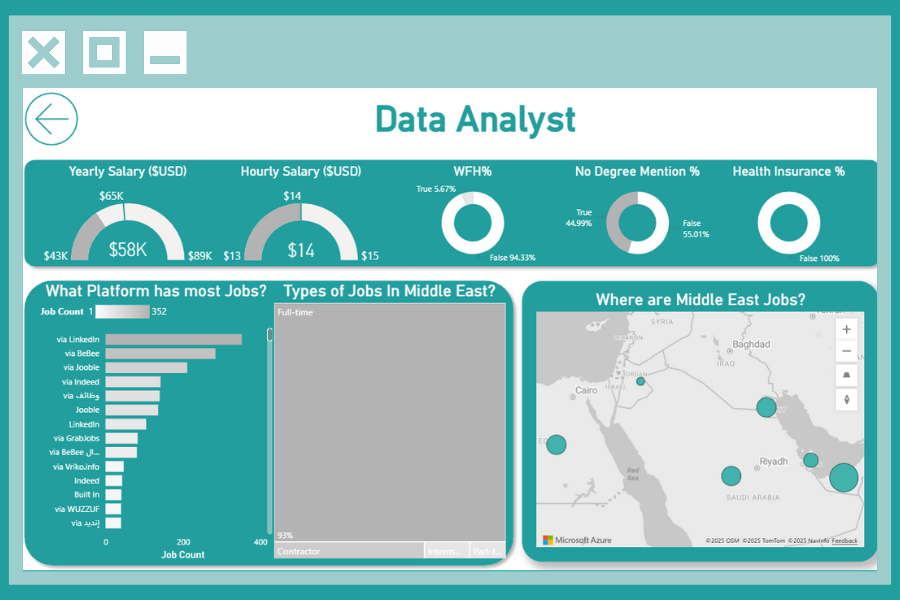

# Middle East Jobs Dashboard Inn Power BI

**Dashboard Page**

## Introduction

This dashboard build for **aspiring professionals, career changers, and opportunity seekers across the Middle East**, the dashboard addresses a common challenge: fragmented and inaccessible insights into the regional data job market. Leveraging a real-world dataset of 2024 middle east job in tech postings—including roles, salaries, and locations—this interactive tool offers a clear, centralized view of market dynamics and compensation trends.

### Dashboard File

You can find the file for the dashboard here: [`Middle_East_Jobs_Dashboard.pbix`](Middle_East_Jobs_Dashboard.pbix).

---

## 🛠️ Skills Showcased

This project demonstrates a comprehensive application of Power BI capabilities, tailored to visualize and explore the Middle East data job market. Here's what was mastered:

- **⚙️ Data Transformation with Power Query**  
  Cleaned and shaped raw job posting data by handling nulls, adjusting data types, and engineering new columns for analysis.

- **🧮 Implicit Measures**  
  Created dynamic measures to extract insights such as `Median Yearly Salary`, `Job Count`, and other key performance indicators.

- **📊 Core Visualizations**  
  Used **Column, Bar, Line**, and **Area Charts** to compare job distributions and highlight temporal trends.

- **🗺️ Geospatial Analysis**  
  Mapped job locations across the Middle East using **Map Charts**, revealing regional hiring patterns.

- **🔢 KPI Cards & Tabular Views**  
  Displayed high-level metrics with **Cards**, and provided detailed, sortable data using **Tables**.

- **🎨 Dashboard Design**  
  Crafted a clean, intuitive layout that balances storytelling with analytical depth—leveraging both standard and niche chart types.

- **🖱️ Interactive Reporting Features**  
  - **Slicers** for filtering by job title and location  
  - **Buttons & Bookmarks** for smooth navigation between views  
  - **Drill-Through Pages** for contextual deep dives from summary metrics

---

## Dashboard Overview

_This report is split into two distinct pages to provide both a high-level summary and a detailed analysis._

### Page 1: High-Level Market View

This dashboard distills the region’s job landscape into actionable insights—track total job count, salary satisfaction, and top-paying roles like Data Analyst and Data Engineer. With real-time trends and granular salary breakdowns, it’s your shortcut to strategic hiring, career planning, or market analysis.

### Page 2: Job Title Drill Through

From the main dashboard, you can zoom into this page to explore granular insights—salary benchmarks, remote work flexibility, degree requirements, and platform-specific job counts. It also maps out hiring hotspots across the Middle East, giving you a geo-aware snapshot of where demand is strongest.

---

## Conclusion

This dashboard exemplifies how Power BI can turn fragmented job data into a strategic career intelligence platform. By enabling users to slice by role, filter by location, and drill into salary and benefit insights, it empowers professionals to navigate the Middle East job market with clarity and confidence. Whether you're a job seeker, recruiter, or analyst, this tool transforms exploration into informed decision-making.
